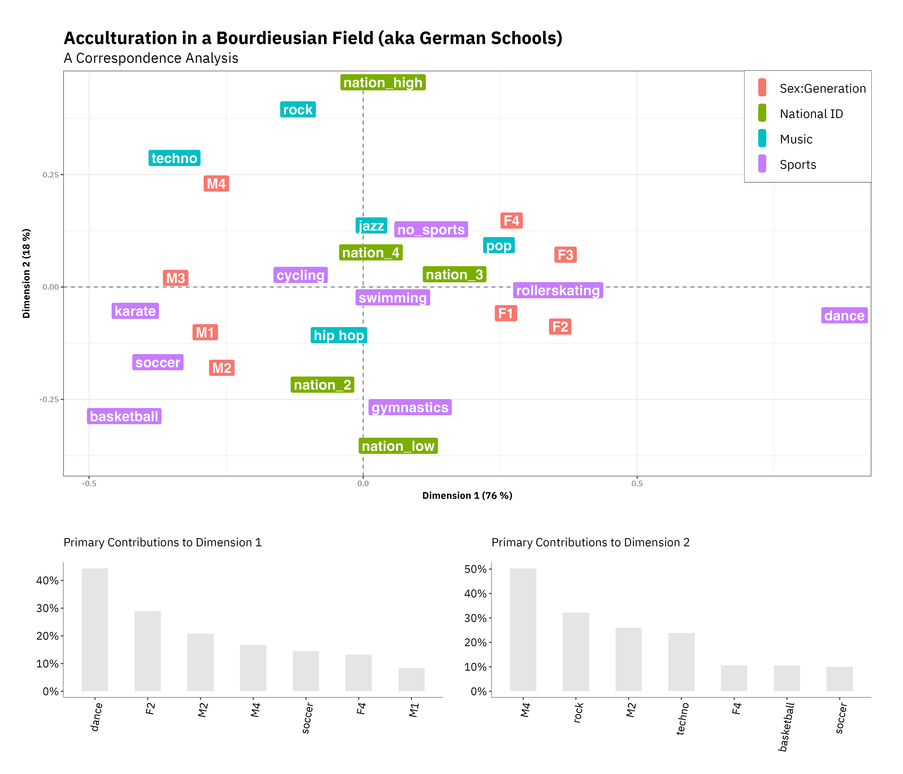

As a member of the 2024-2025 CAnD3 Fellowship cohort, I have had the opportunity to participate in a community of interdisciplinary thinkers advancing data-driven social research and knowledge mobilization. In addition, I have been able to expand my methodological toolkit and to learn from others working at the intersection of academia, industry, and government. For more information on CAnD3, [visit the consortium's website](https://www.mcgill.ca/cand3/)!

One highlight of being a fellow was getting to participate in the [2024 PopAging DataViz workshop](https://www.mcgill.ca/cand3/popaging-dataviz-workshop-2024) at Florida State University. Check out a multiple correspondence analysis plot that I made during the workshop using data from a survey of German youth, in which I explore the relationship between national identification, sex, and various cultural tastes. 

<!--more-->
